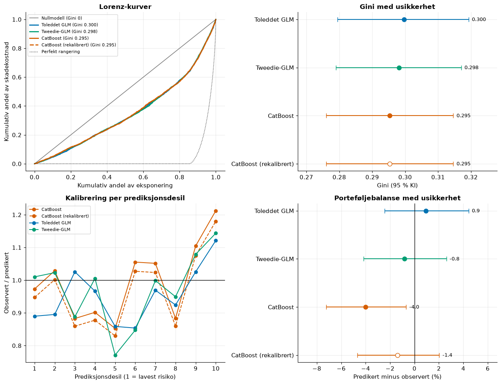
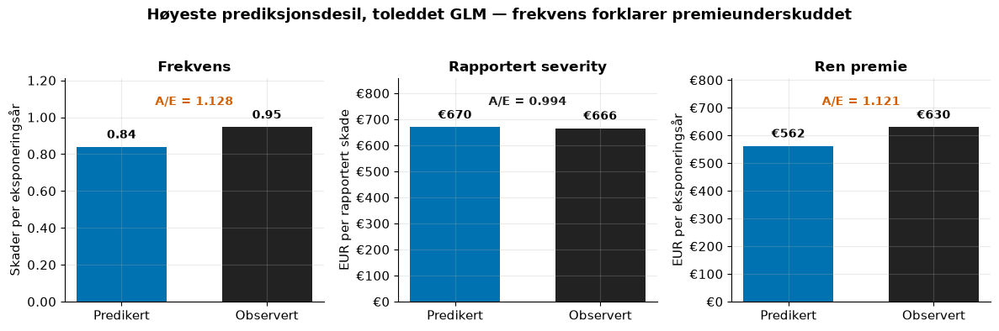
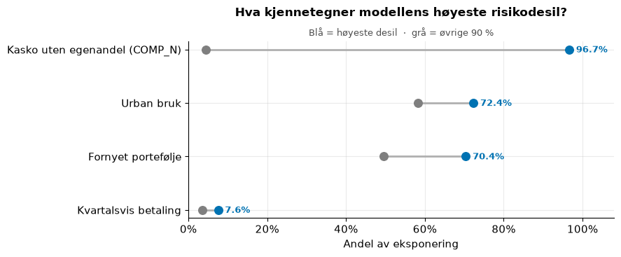
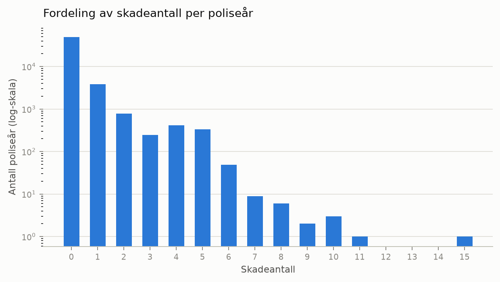

# Motor Insurance Pricing - Generalized Linear Models and ML
---
Dette prosjektet presenterer et rammeverk for forsikringsprising basert på et anonymisert, offentlig tilgjengelig datasett fra spansk motorforsikring i perioden 2022 til 2024. Prosjektet modellerer kun kaskoskader, selv om datasettet inneholder flere ulike dekningstyper, blant annet brann, glass og ansvar (se en mer detaljert diskusjon av dette senere). Denne avgrensningen gjøres på grunn av strukturelle forskjeller i skadeprosessene, og det er derfor sannsynlig at separat modellering vil gi mer presise resultater.

Jeg bygger et frekvens-severity-rammeverk basert på Generalized Linear Models (GLM) for å beregne ren premie. I tillegg inkluderer jeg en Tweedie GLM som modellerer ren premie direkte, samt CatBoost som modellerer teknisk premie direkte. Modellene evalueres på 2024-data som holdes helt utenfor modellutviklingen. Modellene presterer relativt likt på testkriteriene, og bootstrapping brukes derfor for å undersøke om forskjellene mellom dem er reelle eller kan skyldes tilfeldig variasjon.
## Resultater: urørt 2024-testsett

Modellene ble spesifisert og låst på 2022–2023, og evaluert én gang på 2024. Det er brukt
en parvis bootstrap over `insured_id` ($B=10\,000$; 95 % percentilintervall) for å
kvantifisere usikkerheten i forskjeller i Tweedie-deviance og Gini. Alle parvise
intervaller inkluderer null. Modellene kan derfor ikke skilles statistisk på
testsettet; små forskjeller i punktestimat er ikke en dokumentert modellvinner.
Den største devianceforskjellen er mellom toleddet GLM og CatBoost: $0,033$ med
95 % KI $[-0,005, 0,072]$. Gini-forskjellene er høyst $0,004$, med intervaller på
omtrent $\pm 0,006$–$0,007$.

Tweedie-GLM og frekvens–severity-GLM er de foretrukne alternativene fordi de er
transparente og enkle å forklare. Tweedie er det enkleste ett-trinnsalternativet,
mens frekvens–severity er foretrukket når det er viktig å se om en avvikende premie
skyldes skadehyppighet eller skadekostnad. CatBoost tilfører ikke målbar
rangeringsevne i denne evalueringen.

| Modell | Tweedie-deviance ↓ | Gini ↑ | Porteføljebalanse |
|---|---:|---:|---:|
| **Toleddet GLM** | **32,180** | **0,300** | **+0,9 %** |
| Tweedie-GLM | 32,204 | 0,298 | −0,8 % |
| CatBoost | 32,213 | 0,295 | −4,0 % |

**Hvor bommer modellen?** I den toleddede GLM-ens høyeste prediksjonsdesil er
frekvensen 12,8 % høyere enn predikert, mens rapportert severity er nær forventet.
Premieunderskuddet kommer dermed hovedsakelig fra flere rapporterte skader enn
modellen forventer. Severity må tolkes forsiktig fordi den er definert per rapportert
skade, og skadeantallene har et uavklart opphopningsmønster.

| Komponent, høyeste prediksjonsdesil  | Predikert | Observert |       A/E |
| ------------------------------------ | --------: | --------: | --------: |
| Frekvens (skader per eksponeringsår) |     0,839 |     0,946 | **1,128** |
| Rapportert severity (EUR per skade)  |       670 |       666 |     0,994 |
| Ren premie (EUR per eksponeringsår)  |       562 |       630 | **1,121** |

**Hva kjennetegner høyeste risiko?** Risikosegmentet er tydelig produktdrevet:
96,7 % av eksponeringen i høyeste prediksjonsdesil er `COMP_N` (kasko uten egenandel),
mot 4,4 % i resten av porteføljen. Segmentet har også oftere urban bruk og fornyet
forretning. Dette er en beskrivelse av modellens segmentering, ikke kausale effekter.

## Frekvensdiagnostikk fra utviklingsdata

Seksjon 13 i [`01_descriptiv.ipynb`](01_descriptiv.ipynb) viser skadeantallsfordelingen
for 2022–2023. 89,67 % av poliseårene har null skader; gjennomsnittet er 0,1808,
variansen 0,4682 og varians/mean 2,5896. Den sterke nullmassen og den lange, sparsomme
halen gir overspredning relativt til Poisson. Ratingfaktorene har dermed begrenset
informasjon til å skille poliser med og uten skade, og modellen vil naturlig slite
med å hente ut et stabilt frekvenssignal selv om forventningsmodellen er rimelig.

## Rate table-utdrag

vises relativiteter mot modellens referansenivå. `Kombinert` er frekvensrelativitet
multiplisert med severityrelativitet. Dette er et utdrag av den låste
frekvens–severity-modellen, ikke en ferdig kommersiell tariff.

| Faktor/nivå mot referanse | Frekvens | Severity | Kombinert |
|---|---:|---:|---:|
| `policy_type`: `COMP_N` mot `COMP_E` | 3,666 | 0,674 | 2,470 |
| `circulation_area`: `R` mot `U` | 0,851 | 1,107 | 0,942 |
| `business_type`: `P` mot `NB` | 1,357 | 0,920 | 1,249 |
| `payment_frequency`: `Q` mot `A` | 1,434 | 1,000 | 1,434 |
| `payment_frequency`: `S` mot `A` | 1,100 | 1,000 | 1,100 |
| 2022 mot 2023 | 0,920 | 1,051 | 0,967 |
| Dobling av bilverdi | 1,300 | 1,152 | 1,498 |

Alder modelleres med splines i frekvensmodellen og vises derfor ikke som én
koeffisient. En absolutt premie krever dessuten en eksplisitt definert referanserisiko.

## Hva prosjektet gjør

**Datagrunnlag og deskriptiv analyse** ([`01_descriptiv.ipynb`](01_descriptiv.ipynb)) — avgrenser analysen til kaskoskader for `COMP_E` og `COMP_N`, med aktiv dekning og positiv eksponering. Utvalget for 2022–2023 består av 55 246 poliseår, 37 126 eksponeringsår og 9 989 registrerte skader. `CC` holdes utenfor som en liten og uensartet produktgruppe.

**Manglende verdier og validering** — GLM-ene erstatter manglende numeriske prediktorer med medianen og behandler manglende kategorier som `MISSING`. CatBoost bruker også `MISSING` for kategorier og håndterer numeriske mangler direkte. Samme forsikringstaker holdes adskilt mellom trening og validering.

**Frekvens** ([`02_frekvens.ipynb`](02_frekvens.ipynb)) — bruker en Poisson-GLM med log-link og eksponeringsvekter for å predikere forventet antall egen-skader per eksponeringsår. Dette gir samme estimering som å modellere skadeantall med logaritmen til eksponeringen som offset. Den valgte modellen har 12 parametere, inkluderer en ikke-lineær alderseffekt og `business_type`, og har OOF Poisson-deviance på 1,1222. Ingen gyldig testede interaksjoner ble valgt. CatBoost-residualdiagnostikken gir heller ikke et stabilt tegn på manglende struktur: den beste varianten forbedrer deviancen med bare 0,0003 og i tre av fem folder.

**Severity** ([`03_severity.ipynb`](03_severity.ipynb)) — bruker en Gamma-GLM med log-link, vektet med skadeantall, for å predikere kostnad per registrert egen-skade. Modellen bruker 5 698 poliseår med positiv skadekostnad, som omfatter 9 979 skader. Den valgte syvparametersmodellen har OOF Gamma-deviance på 0,7237 og kombineres med frekvensmodellen til en todelt modell for ren premie. CatBoost-residualdiagnostikken forverrer deviancen med 0,0022 i den mest fleksible varianten og gir ingen indikasjon på manglende struktur.

**Tweedie** ([`04_tweedie.ipynb`](04_tweedie.ipynb)) — bruker en Tweedie-GLM med log-link og eksponeringsvekter, uten offset, for å predikere ren premie direkte, som ett-trinnsalternativet til frekvens $\times$ severity. Den valgte 15-parametersmodellen bruker $p = 1{,}744$ og har OOF Tweedie-deviance på 33,2572. CatBoost-residualdiagnostikken reduserer deviancen med 0,0061 (0,018 %) i fire av fem folder. Det er et svakt signal om gjenværende kompleksitet, men påviser ikke en bestemt interaksjon eller ikke-linearitet og endrer ikke modellen.

**CatBoost** ([`05_catboost.ipynb`](05_catboost.ipynb)) — er maskinlæringsutfordreren som bruker Tweedie-tapsfunksjon til å predikere ren premie direkte. Den oppnår pooled OOF-deviance på 33,2775 mot 34,0919 for nullmodellen ($D^2 = 0,0239$). Dette er en utviklingsscore, ikke en endelig testscore.

**Endelig sammenligning** ([`model_results.ipynb`](model_results.ipynb)) — når alle spesifikasjoner er låst, lastes de refittede modellene og vurderes én gang på 2024 som et urørt out-of-sample-testsett. Sammenligningen vurderer både prediktiv rangering og kalibrering av ren premie, og brukes til å skille mellom modeller med tilnærmet like resultater på ett enkelt kriterium.

---
## Variabelseleksjon

GLM-ene starter med en faglig begrunnet baseline, definert fra den deskriptive analysen og underwritinglogikk. Baselineen er et underwriting-utgangspunkt, ikke resultatet av et automatisk søk. Tabellen viser hele kandidatregisteret: `Baseline` betyr at variabelen inngår i K0, mens `Testet` betyr at den vurderes senere i seleksjonsløpet. CatBoost bruker hele den forhåndsdefinerte prediktorlisten og har ikke samme seleksjonsløp.

| Variabel                   | Frekvens | Severity | Ren premie (Tweedie) |
| -------------------------- | :------: | :------: | :------------------: |
| `policy_type`              | Baseline | Baseline |       Baseline       |
| `year`                     | Baseline | Baseline |       Baseline       |
| `driver_age`               | Baseline | Baseline |       Baseline       |
| `log_vehicle_value`        | Baseline | Baseline |       Baseline       |
| `circulation_area`         | Baseline |  Testet  |       Baseline       |
| `municipality_type`        |  Testet  | Baseline |        Testet        |
| `payment_frequency`        | Baseline |  Testet  |        Testet        |
| `performance_hp_per_tonne` |  Testet  |  Testet  |        Testet        |
| `fuel_type`                |  Testet  |  Testet  |        Testet        |
| `business_type`            |  Testet  |  Testet  |        Testet        |
| `vehicle_brand_pooled`     |  Testet  |  Testet  |        Testet        |
| `seat_category`            |  Testet  |  Testet  |        Testet        |

**Interaksjoner** — frekvens- og Tweedie-modellene vurderer tre forhåndsdefinerte kandidater:

- `driver_age × performance_hp_per_tonne`: sammenhengen mellom kjøretøyytelse og skade kan være annerledes for yngre og eldre førere.
- `driver_age × policy_type`: alderseffekten kan variere mellom produktene, som har ulike vilkår og kunde-/risikomiks.
- `driver_age × log_vehicle_value`: sammenhengen mellom bilverdi og skade kan variere med alder og erfaring.

En interaksjon testes bare når begge hovedeffektene allerede er i modellen, og den må bestå den samme firleddsregelen som øvrige kandidater. Severitymodellen har ingen interaksjonsrunde. Ingen interaksjoner ble beholdt i de endelige modellene.

- **`policy_type`** skiller mellom produkter med ulike vilkår og risikopopulasjoner, og er derfor relevant for både antall skader og kostnaden når en skade oppstår.
- **`year`** fanger endringer i portefølje, skadeutvikling og kostnadsnivå mellom utviklingsårene. Den beholdes i alle modeller for å skille slike forskjeller fra effektene til de øvrige risikofaktorene.
- **`driver_age`** helt sentral ettersom risiko ofte er knyttet til alder. Dette er også en god kandidat for splines utifra den deskriptive analysen.
- **`log_vehicle_value`** - Særlig relevant for reparasjons- og erstatningskostnad, men kan også fange kjøretøy- og kundesammensetning som henger sammen med frekvens.
- **`circulation_area`** angir om bilen hovedsakelig brukes i urbant (`U`) eller ruralt (`R`) område. Bytrafikk gir plausibelt flere kollisjonsmuligheter og er derfor særlig relevant for skadefrekvens; variabelen er geografisk baseline for frekvens og ren premie.
- **`municipality_type`** angir kommunetypen der bilen er forsikret: innland (`I`), kyst (`C`) eller øyer (`IS`). Den kan fange geografisk variasjon i portefølje og skadekostnader, og er severitymodellens geografiske baseline.

De to geografivariablene testes både som alternativer og sammen. Ingen sluttmodell beholder begge: de beskriver delvis samme geografiske signal, og den ekstra variabelen må derfor dokumentere stabil, selvstendig prediktiv verdi for å bli med. Dette skjedde ikke i seleksjonen.
- **`payment_frequency`** er frekvensmodellens kontraktsvariabel. Den kan reflektere forskjeller i kunde- og kontraktsmiks som samvarierer med rapportert skadefrekvens; den tolkes ikke kausalt.

Variablene testes videre med fem gruppefolder på `insured_id`. Seleksjonalgoritmen er utformet slik at ekstra frihetsgrader inkluderes dersom signalet ikke kan skilles fra støy. En kandidat beholdes bare dersom den oppfyller alle fire kriteriene:

1. Gir lavere samlet OOF-deviance enn modellen den utfordrer.
2. Gir lavere deviance i minst fire av fem valideringsfolder.
3. Gir en gyldig tilpasning i alle fem folder.
4. Har en gjennomsnittlig foldgevinst større enn én standardfeil.

Frekvens bruker Poisson-deviance, severity Gamma-deviance og Tweedie ren-premie-deviance. Etter baseline testes funksjonsform, geografisk alternativ, ytterligere variabler, relevante interaksjoner i frekvens og Tweedie, og til slutt ablasjon av overflødige ledd.

**Ablasjonssteg** — hvert ikke-låste ledd prøves fjernet. Det tas ut bare når den enklere modellen består den samme firleddsregelen, slik at sluttmodellen ikke beholder overflødige ledd.

Alder utfordres med naturlige kubiske splines med 2, 3 og 4 frihetsgrader fordi en rett linje kan skjule ikke-lineær risiko etter alder. Frekvens beholder en spline med 4 frihetsgrader og Tweedie en spline med 3, mens severity beholder alder lineært. En spline for `log_vehicle_value` testes også fordi den deskriptive analysen indikerte at funksjonsformen kunne være ikke-lineær. Den ble ikke valgt i noen av de tre GLM-ene; log-bilverdi beholdes lineært.

## Utelatte variabler

- **`vehicle_age`** er trolig førerkortansiennitet, ikke reell kjøretøyalder. Fordi kildedefinisjonen mangler, brukes feltet ikke.
- **`bonus_score`** og **`policy_status`** utelates fordi tidspunktet er uavklart og kan gi lekkasje. `age_driving_licence` og `driving_experience_years` er også uavklart eller for sterkt overlappende med `driver_age`.
- Rå `vehicle_value`, `power_to_weight_ratio` og `vehicle_brand` erstattes av transformerte modellvariabler. ID-er, utfall, premier og eksponering brukes aldri som prediktorer.
## Repo-struktur

Oversikten er begrenset til notebooks og `src_*`-støtteskript.

| Område | Innhold | Ansvar |
|---|---|---|
| Notebooks | `01_descriptiv`–`05_catboost`, `model_results` | Analyse, spesifikasjon, modellering og låst testevaluering |
| `src_core_glm/` | Dataforberedelse, GLM-grunnmur, CV og seleksjon | Felles modellinfrastruktur |
| `src_descriptives/` | Datakvalitet, dekning og porteføljebeskrivelser | Deskriptiv analyse |
| `src_frequency/`, `src_severity/`, `src_tweedie/` | Modellspesifikke diagnostikk- og støttefunksjoner | GLM-fasene |
| `src_ml/` | CatBoost-prising | Maskinlæringsutfordrer |
| `src_model_comparison/` | Låste modeller, bootstrap, kalibrering og figurer | Endelig modellsammenligning |
| `src_asserts/` | Modell- og diagnostikktester | Verifikasjon |

## Videre arbeid og begrensninger

Prosjektet modellerer kun kaskoskader. Ansvarsskader kan ha en mer fremtredende
halerisiko og ville kreve en egen modellstrategi, eventuelt med separat hale- eller
stor-skadebehandling.

## Datakilde og begrensninger

Dataene er spanske motorforsikringsdata publisert sammen med den faglige beskrivelsen i [PMC-artikkelen](https://pmc.ncbi.nlm.nih.gov/articles/PMC13234478/).

Dette er et pedagogisk porteføljeprosjekt. Resultatene er ikke en produksjonsklar tariff og må ikke brukes direkte til kommersiell prising uten ytterligere validering, governance og vurdering av regulatoriske krav.
